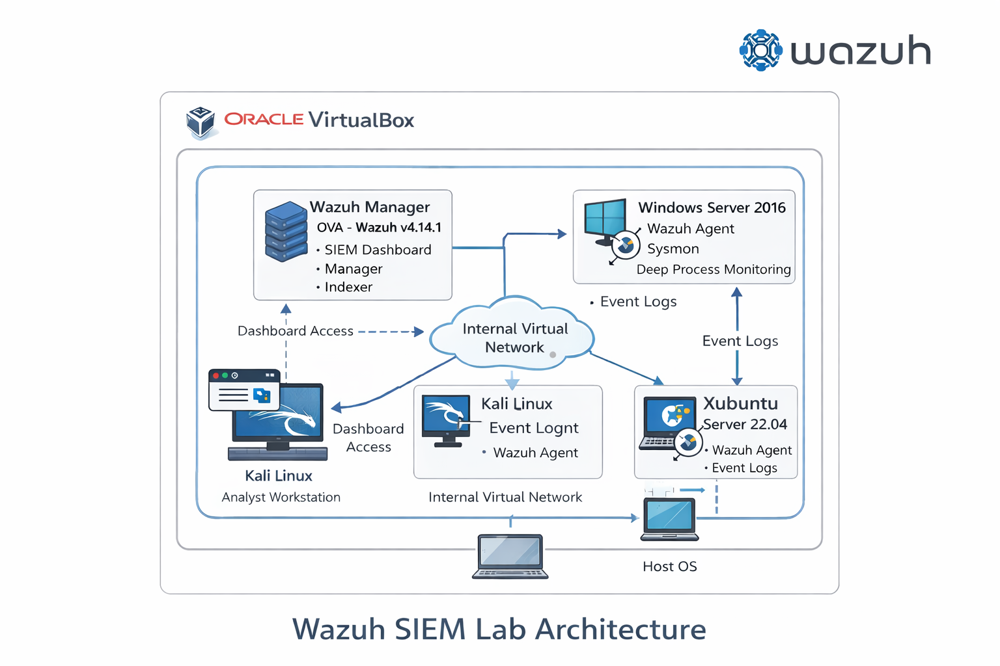

 # Enterprise EDR & Threat Hunting Grid 

## Project Overview
This project demonstrates the deployment, configuration, and validation of a Wazuh-based SIEM environment.  
The objective is to simulate a real-world SOC setup including infrastructure deployment, endpoint monitoring, and custom detection logic.

The project is divided into two phases:
- Week 1: Infrastructure & Agent Deployment
- Week 2: Detection Rules & Alert Validation
- Week 3: Active Response (IPS)
- Week 4: Threat Simulation

---

## Architecture Overview
- Wazuh Manager deployed on a dedicated Linux server
- Windows Server with Wazuh Agent + Sysmon
- Linux Web Server with Wazuh Agent
- Centralized monitoring via Wazuh Dashboard

---
## Architecture Diagram

The following diagram illustrates the Wazuh SIEM lab deployed inside Oracle VirtualBox.




## Project Objectives
- Deploy and validate Wazuh Manager and Agents
- Enable deep visibility using Sysmon on Windows
- Configure File Integrity Monitoring (FIM)
- Develop custom decoders and rules
- Validate alert generation and response time
- Configure Active Response (IPS)
- Threat Simulation Atomic Red Team Framework 


---

## Week-wise Breakdown

- 📁 **Week 1: Infrastructure & Agent Deployment**  
  👉 [Open Week 1](#week-1-infrastructure--agent-deployment)  

- 📁 **Week 2: Detection Rules & Logic Implementation**  
  👉 [Open Week 2](#week-2-detection-rules--logic-implementation)  

- 📁 **Week 3: Active Response Configuration *(Planned)***  
  👉 [Open Week 3](#week-3-active-response-configuration-planned)  

- 📁 **Week 4: Atomic Red Team Simulation & MITRE Mapping *(Planned)***  
  👉 [Open Week 4](#week-4-atomic-red-team-simulation--mitre-mapping-planned)  

---

## Week 1: Infrastructure & Agent Deployment
- Deployed Wazuh Manager (OVA v4.14.1)
- Installed agents on Ubuntu Server 22.04 and Windows Server 2016
- Enabled Sysmon for deep telemetry
- Verified agent heartbeat and log ingestion

**Additional Notes:**
- Configured log forwarding to SIEM
- Tested alert generation for sample events

### Screenshots


### Commands Used
```bash
sudo systemctl start wazuh-manager
sudo systemctl status wazuh-agent


---

## Team Members
- Siddhant Misal– Project Lead
- Fathimath Asmeera BK
- MdKaif Raza
- Jiss 

---

## Conclusion
This project provides hands-on experience in SIEM deployment, endpoint telemetry, log parsing, and detection engineering, aligned with real SOC operations.

## Review & Gate Check Validation

| Requirement | Status |
|------------|--------|
| Wazuh Manager deployed (v4.14.1) | ✅ |
| Ubuntu Server 22.04 agent active | ✅ |
| Windows Server 2016 agent active | ✅ |
| Sysmon installed and logging | ✅ |
| All agents reporting heartbeat | ✅ |
| FIM alert generated < 5 seconds | ✅ |
| Custom decoders & rules working | ✅ |
| Screenshots embedded in README | ✅ |
| Team member contributions | ✅ |
