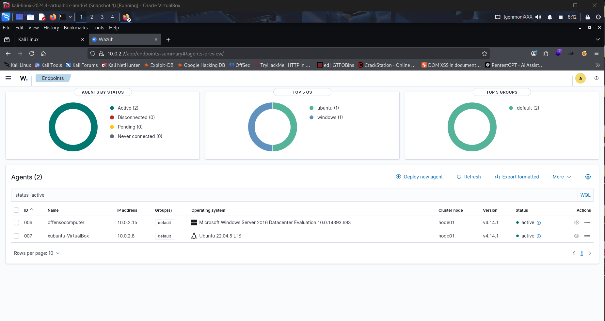
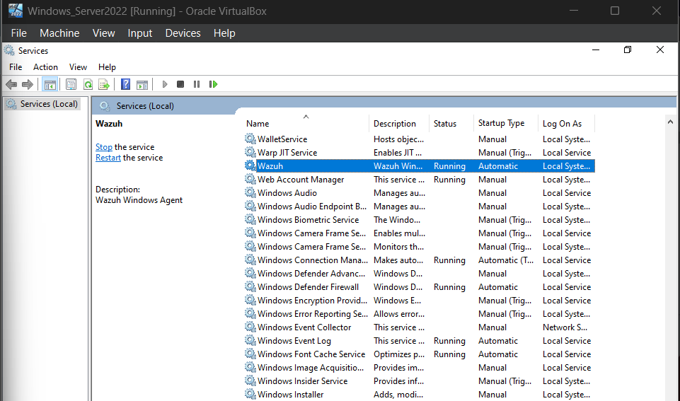
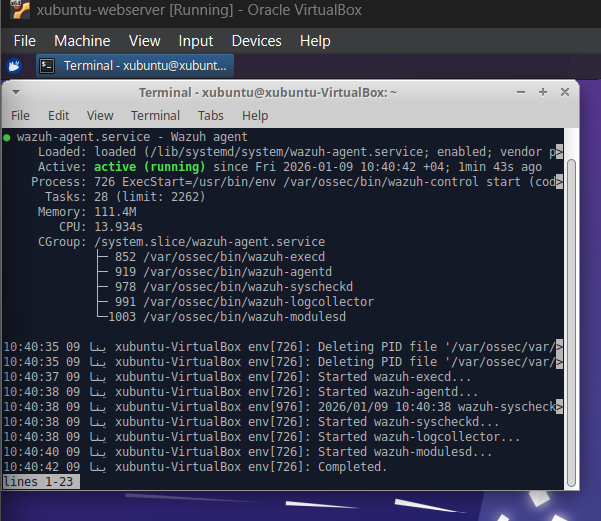
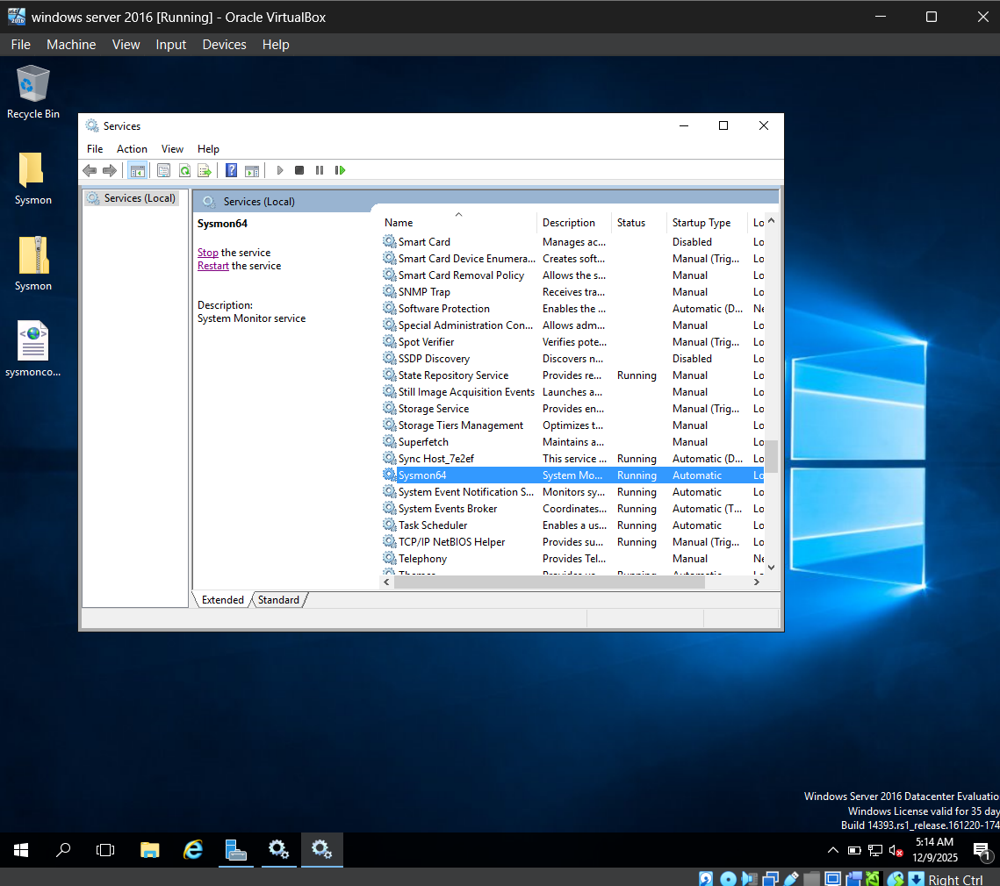
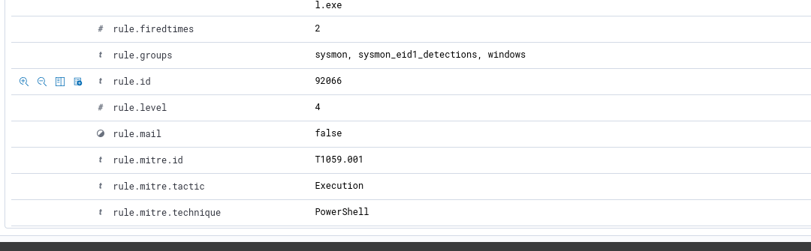

# Week 1: Infrastructure & Agent Deployment Overview

- Deployed Wazuh Manager (OVA v4.14.1)
- Installed agents on Ubuntu Server 22.04
- Installed agents on Windows Server 2016
- Enabled Sysmon for deep telemetry
- Verified agent heartbeat and log ingestion

---
 ### WAZUH-MANAGER DASHBOARD

---
### Agent status Windows

### Agent status Linux

### Sysmon

---

 **[Back to Main Page](../README.md#-Weekly-Breakdown)**
---
