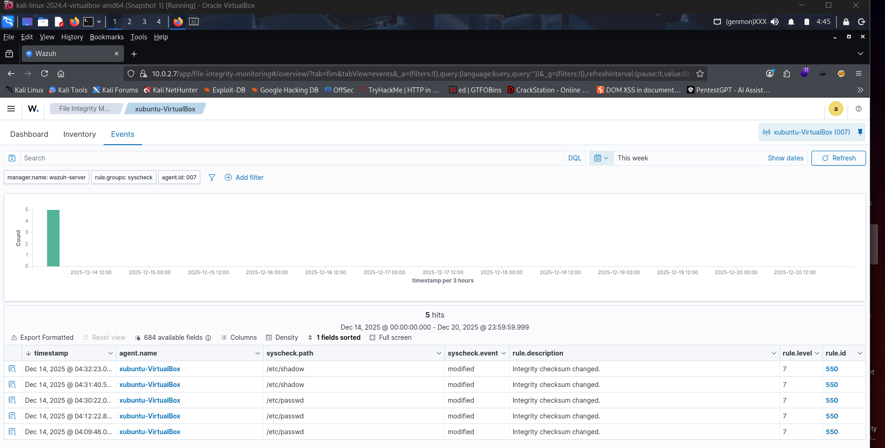
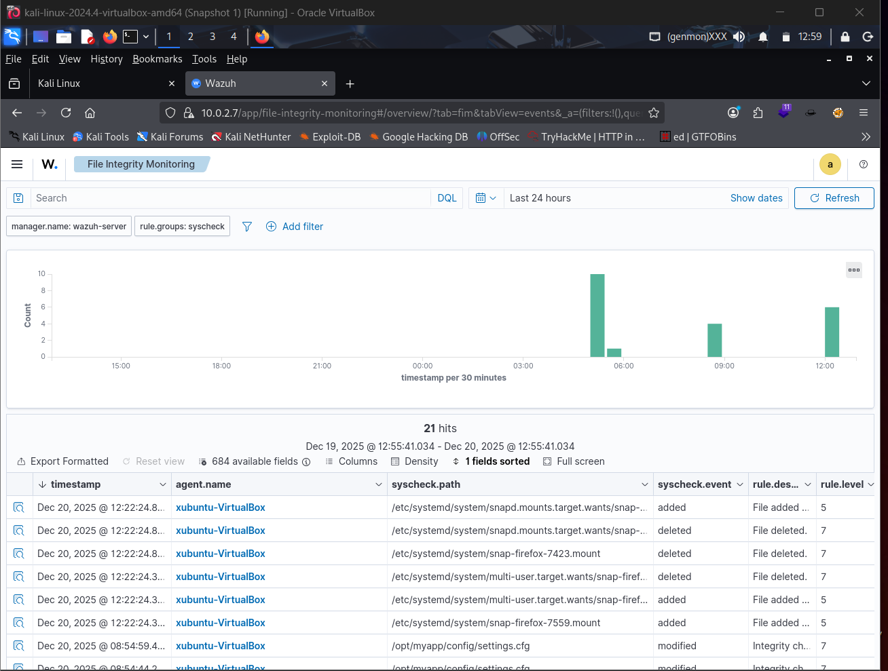
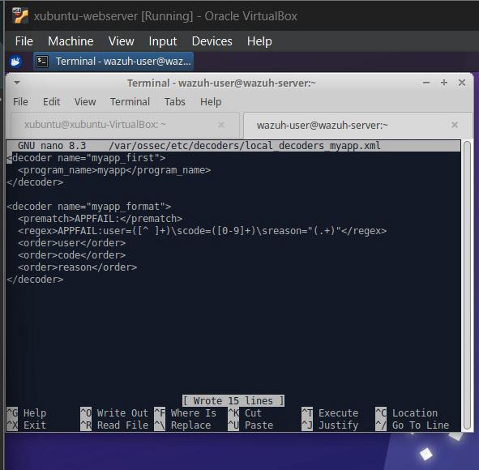
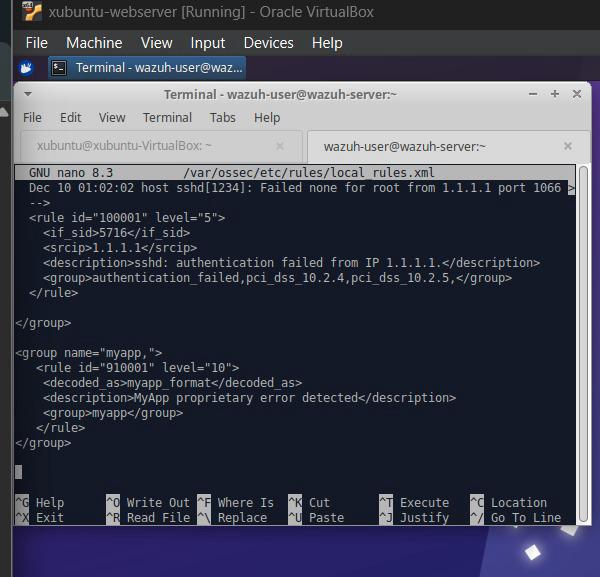
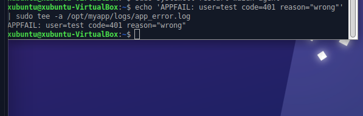
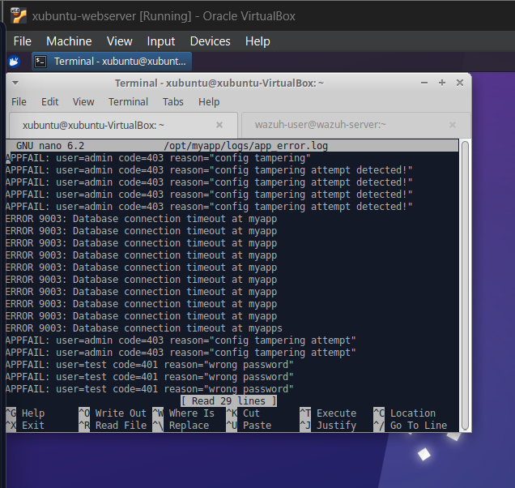
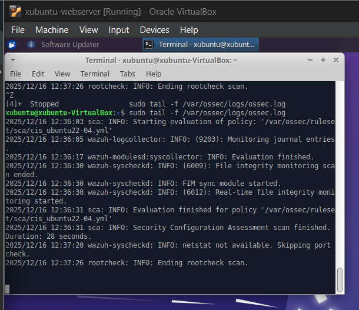
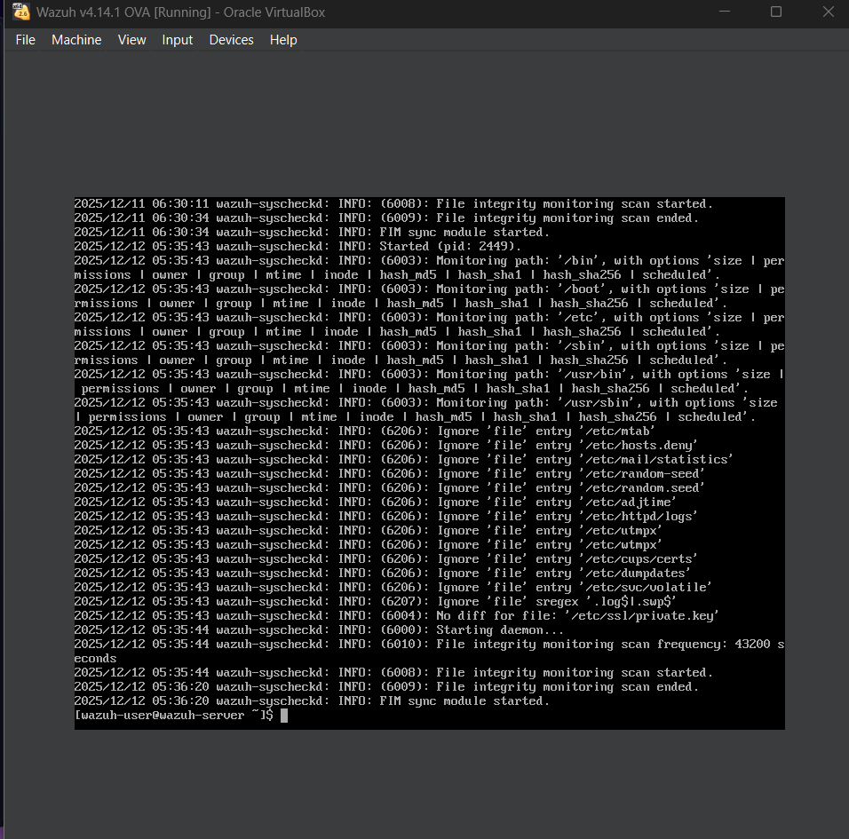
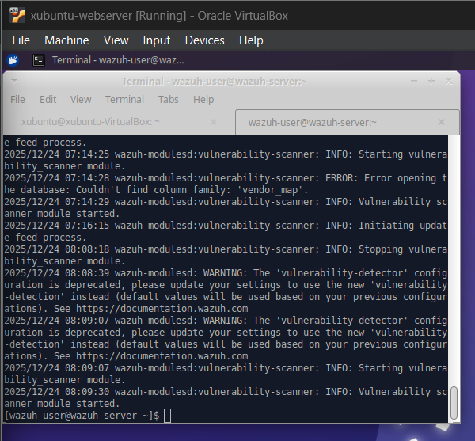

# Week 2 – Detection Rules (The Logic)

## 📌 Overview
This week focuses on **detection engineering** by configuring **File Integrity Monitoring (FIM)**, creating **custom XML decoders and rules**, and enabling the **Vulnerability Detector** module.  
The objective is to detect unauthorized file changes and proprietary application log events with **high-severity alerts** in near real-time.

---
## Objectives

- Configure **File Integrity Monitoring (FIM)** for critical system directories (`/etc/`,`/var/www/`,`C:\Windows\System32\`) 
- Configure **File Integrity Monitoring (FIM)** for sensitive application directories
- Create **custom XML decoders** for proprietary application logs
- Write **custom detection rules** with high severity
- Enable and verify the **Vulnerability Detector** module
- Validate alerting through a **manual gate check**

---
## Tools & Technologies
- **Wazuh SIEM**
- **Wazuh Agent & Manager**
- **Linux (Ubuntu / Kali Linux)**
- **Custom XML Decoders**
- **Custom Detection Rules**
- **Wazuh Dashboard**

---

## Implementations

### File Integrity Monitoring (FIM)

- Enabled real-time FIM on critical system directories
- Enabled real-time FIM on sensitive application directories
- Configured monitoring to detect:
  - File creation
  - File modification
  - File deletion
- Ensured alerts are generated immediately upon unauthorized changes

### 2️⃣ Custom XML Decoders
- Created custom decoders to parse a **proprietary application log format**
- Extracted key fields such as:
  - Log level
  - Action type
  - Message content
- Validated decoder functionality using real log entries

### 3️⃣ Custom Detection Rules
- Developed high-severity rules linked to custom decoders
- Mapped rules to **MITRE ATT&CK techniques**
- Ensured accurate correlation and alert classification

### 4️⃣ Vulnerability Detector
- Enabled the Vulnerability Detector module on agents
- Verified:
  - CVE data ingestion
  - Agent vulnerability reporting
- Confirmed visibility in the Wazuh dashboard

---

## 🚦 Gate Check Validation
**Scenario:** Manual modification of a file in a monitored directory

### Result:
- ✅ File modification detected
- ✅ High-severity alert generated
- ✅ Alert visible in dashboard **within 5 seconds**

This confirms correct FIM configuration, rule logic, and alerting performance.

---

## Screenshots
### File Integrity Monitoring Alert

### Custom Decoder and Rule set in Manager OSSEC.CONF

### Adding lines to My app logs file that triggers file changes

### Agent Logs and Manager Logs after File Changes

### Vulnerability Detector Enabled

---

