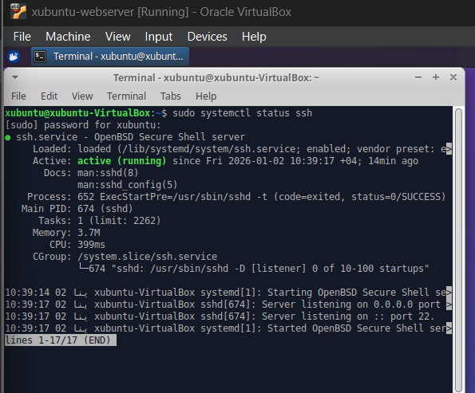
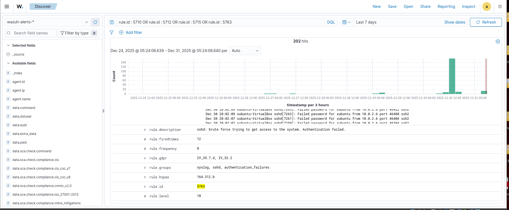
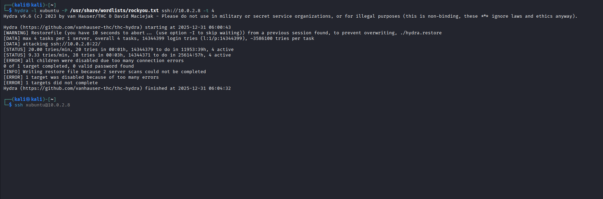
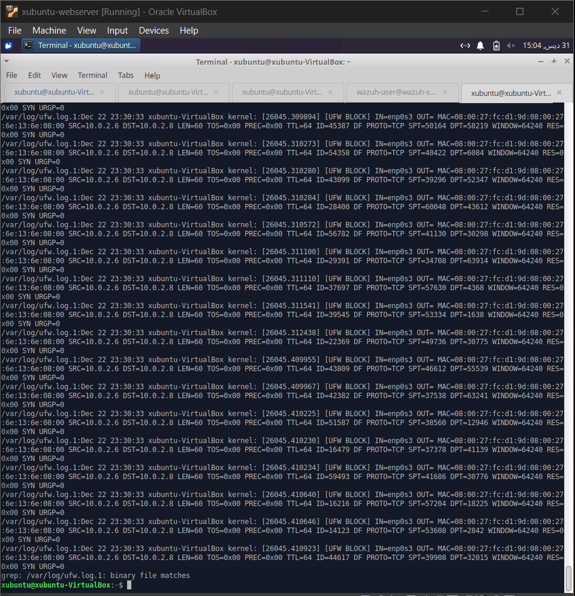
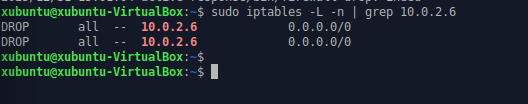
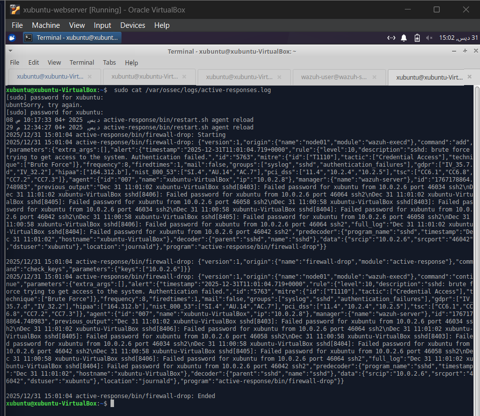
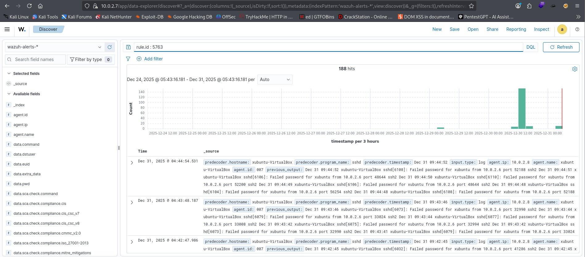
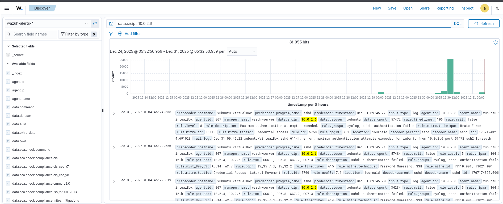
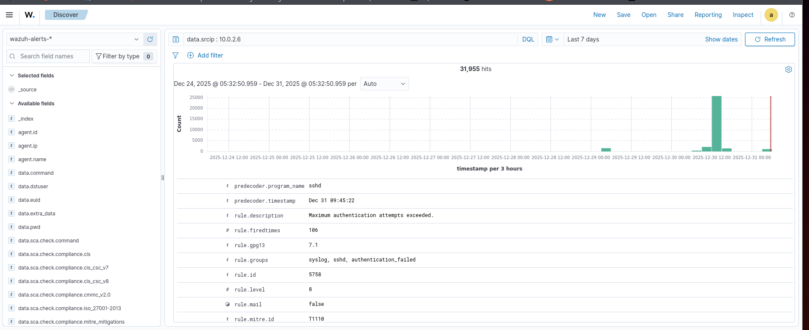

# Week 3 – Active Response (IPS) using Wazuh

## Objective
The goal of Week 3 is to implement and validate **Intrusion Prevention System (IPS)** functionality using **Wazuh Active Response**.  
A simulated **SSH brute-force attack** is launched from an attacker machine, and Wazuh is configured to automatically block the attacker’s IP using a firewall rule on the target host.

---

## Environment Setup

| Component | Role | IP Address |
|---------|-----|-----------|
| Wazuh Manager | Detection & Response | 10.0.2.7 |
| Xubuntu | Wazuh Agent (Target) | 10.0.2.8 |
| Kali Linux | Attacker | 10.0.2.6 |

Network Mode: **NAT Network**

---

## Tools & Technologies Used
- Wazuh Manager & Agent
- SSH (OpenSSH)
- Hydra (Brute-force simulation)
- UFW / iptables
- Kali Linux
- Xubuntu Linux

---

## Step 1: SSH Service Validation on Target Host

The SSH service was verified and enabled on the Xubuntu agent machine to allow SSH-based attack simulation.

**Command:**
```bash
sudo systemctl status ssh
```

---

## Step 2 – Wazuh Active Response Configuration

Wazuh Active Response allows the system to **automatically react** when a security rule is triggered.  
In this task, the response action is **firewall-drop**, which blocks the attacker’s IP at the host firewall level.

This converts Wazuh from a **detection-only system** into an **IPS (Intrusion Prevention System)**.

---

### Configuration on Wazuh Manager

The `firewall-drop` script is already available on the manager at:

```bash
/var/ossec/active-response/bin/firewall-drop
```

The following Active Response command is defined in the Wazuh configuration file.

#### Edit configuration file
```bash
sudo nano /var/ossec/etc/ossec.conf
```

#### Active Response command block
```xml
<command>
  <name>firewall-drop</name>
  <executable>firewall-drop</executable>
  <timeout_allowed>yes</timeout_allowed>
</command>
```

---

### Whitelist Configuration (Important)

Trusted systems are whitelisted to prevent accidental blocking.

The attacker machine (Kali Linux) IP is **intentionally NOT whitelisted**.

```xml
<global>
  <white_list>127.0.0.1</white_list>
  <white_list>10.0.2.7</white_list> <!-- Wazuh Manager -->
  <white_list>10.0.2.8</white_list> <!-- Xubuntu Agent -->
</global>
```

---

### Restart Wazuh Manager

```bash
sudo systemctl restart wazuh-manager
```

---

## Step 3 – SSH Brute Force Attack Simulation

SSH brute-force attacks attempt multiple login attempts using common or leaked passwords.  
This is a very common real-world attack and is frequently detected in SOC environments.

Hydra is used to simulate this attack from the attacker machine.

---

### Attack Execution (Kali Linux)

```bash
hydra -l xubuntu -P /usr/share/wordlists/rockyou.txt ssh://10.0.2.8
```

This generates multiple failed SSH login attempts in a short time.
---


---

## Step 4 – Detection and Active Response Trigger

### Theory

When Wazuh detects repeated SSH authentication failures, it triggers a predefined rule.  
This rule activates the **firewall-drop active response**, which blocks the attacker’s IP address automatically.

No manual intervention is required.

---

## Step 5 – IPS Verification (Gate Check)

### Theory

After the active response is triggered, the attacker should no longer be able to access the target system via SSH.

---

### SSH Access Test (Kali Linux)

```bash
ssh xubuntu@10.0.2.8
```

### Observed Output

```text
kex_exchange_identification: read: Connection reset by peer
Connection reset by 10.0.2.8 port 22
```

This confirms:
- Firewall rule applied successfully
- Attacker IP blocked
- IPS functionality working as expected
#### SSH Connection blocked






---

## Step 6 – Firewall Rule Verification (Target Host)

### Check UFW status

```bash
sudo ufw status
```

OR

### Check iptables rules

```bash
sudo iptables -L -n
```
---
This confirms the attacker IP has been added to the firewall block list.



---

## Step 7 – Wazuh Alert Verification

### View alerts on Wazuh Manager

```bash
sudo tail -f /var/ossec/logs/alerts/alerts.json
```
---
Or,

```bash
sudo cat /var/ossec/logs/active-response.log
```
---

Optional filter:
```bash
grep "firewall-drop" /var/ossec/logs/alerts/alerts.json
```
---
#### Wazuh alert showing active response







---

## Results

✔ SSH brute-force attack detected  
✔ Active response triggered automatically  
✔ Attacker IP blocked using firewall rules  
✔ IPS functionality validated successfully  

---

## Conclusion

This task demonstrates the successful implementation of **Wazuh Active Response** as an **Intrusion Prevention System (IPS)**.  
The system was able to detect a real-world attack pattern and automatically prevent further access by blocking the attacker at the firewall level.

This capability is critical in SOC environments where rapid response is required to minimize attack impact.

---

